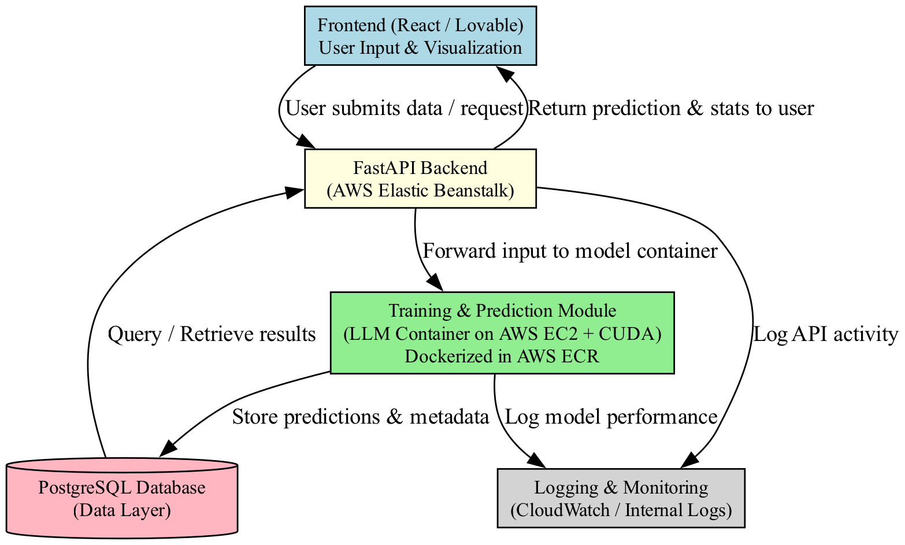
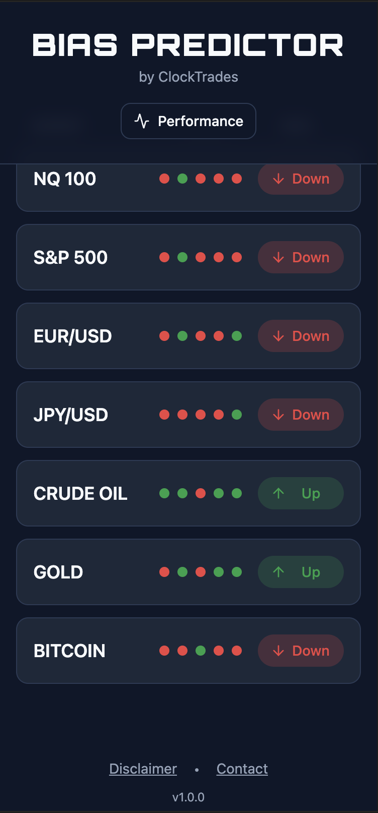
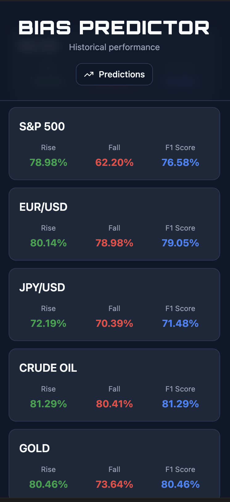
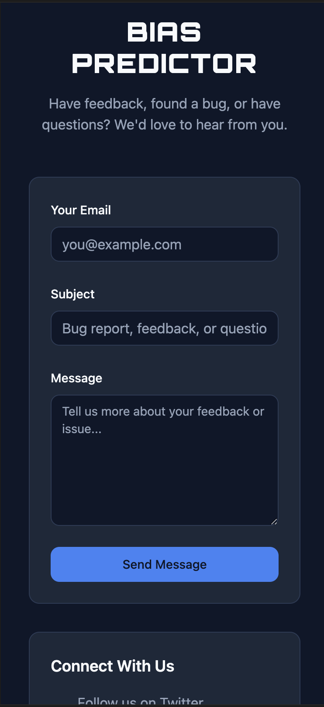

## Overview

**Bias Predictor** is a research and educational app that uses machine learning to estimate short-term directional "bias" for major financial assets such as the **S&P 500, Nasdaq, Gold, Oil, EUR/USD, JPY/USD, and Bitcoin**.  

The system demonstrates how **modular AI pipelines** — combining model inference, cloud-based data handling, and lightweight web apps — can provide data-driven insights into market behavior without offering financial advice.

---

## Source Code

- **Full backend + ML pipeline:** [ts-bias-predictor](https://github.com/katiapek/ts-bias-predictor)

---

## Why It Matters

Bias Predictor showcases how **machine learning, data pipelines, and clean interfaces** can make complex financial data accessible to learners, traders, and researchers.  

Instead of predicting prices, the model simplifies direction (“Up” or “Down”), allowing users to study probabilities, accuracy, and decision-making — the essence of real trading research.

---

## Features

- **ML-Powered Directional Bias** — daily predictions for multiple markets  
- **Historical Performance Tracking** — precision, recall, and F1 metrics for validation  
- **FastAPI Backend** — secure API serving predictions and metrics  
- **React Frontend (Lovable)** — clean, mobile-first UI  
- **AWS Infrastructure** — containerized model and backend for scalability  
- **Educational Focus** — designed for research and insight, not trading advice  

---

## Architecture

Bias Predictor follows a **three-layer modular architecture**:

- **Model & Prediction Layer (AWS ECR + EC2 CUDA)**  
  LLM-based model container running training and inference on NVIDIA-powered EC2 instance.  
  Outputs stored in S3 and PostgreSQL.

- **Data Layer (PostgreSQL + S3)**  
  Central repository for predictions, metrics, and historical datasets.

- **Backend Layer (FastAPI on AWS Elastic Beanstalk)**  
  REST API connecting frontend to prediction and metric data, secured via API key.

- **Frontend Layer (React / Lovable.dev)**  
  Web app for visualization and user interaction, with embedded disclaimer and contact form.

---

## Screenshots

| Market Predictions | Metrics | Contact |
|------------|--------------------|---------|
|  |  |  

---

## Future Plans / Roadmap

- User feedback & contact form integration (via backend API + AWS SES)  
- Historical performance charts  
- Improved model retraining automation  
- Mobile app release (iOS / Android)  
- Expanded coverage to more tickers  

---

## 📜 License

MIT

Demo code for educational and portfolio purposes only — not for production or financial decision-making.
